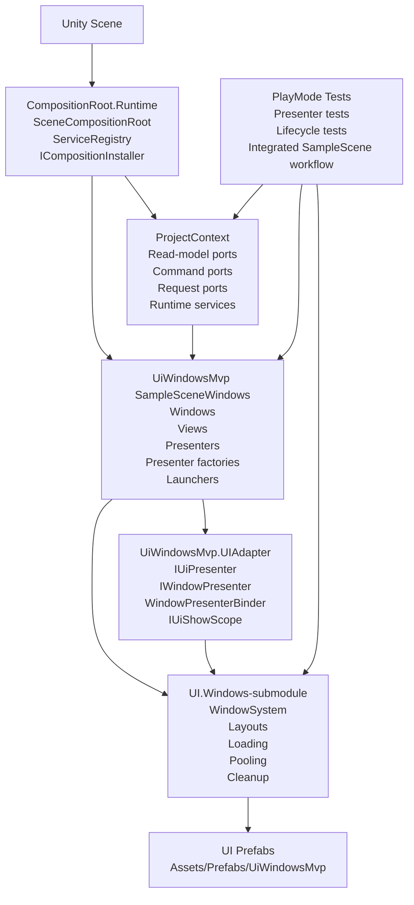
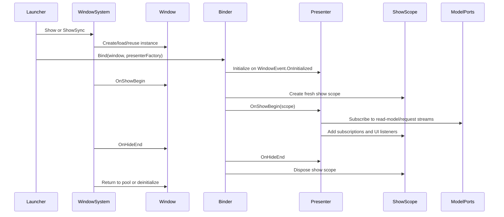
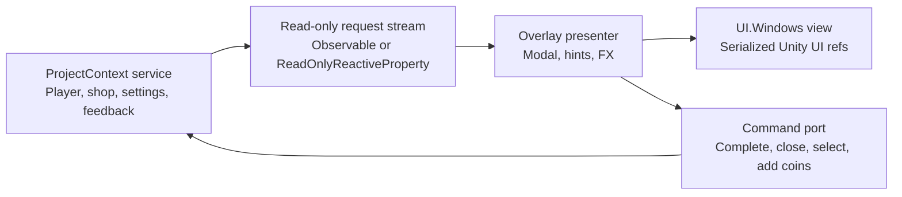

# Reference Architecture Diagram

This document gives a compact visual map of the UI.Windows MVP reference architecture.

## Layer Ownership



## Dependency Direction

Allowed direction:

```text
Unity scene
  -> CompositionRoot installers
    -> ProjectContext services and ports
    -> UiWindowsMvp presenter factories and launchers
      -> UIAdapter
      -> UI.Windows WindowSystem
      -> UI prefabs/views
```

Important boundaries:

- `CompositionRoot.Runtime` is reusable scene composition infrastructure. It must not depend on UI.Windows, MVP, OpenUI, Zenject, UniRx, or R3.
- `ProjectContext` owns application/model services and ports. It may expose R3 read-only state or streams, but must not depend on UI.Windows, Unity UI, presenters, DOTween, OpenUI, Zenject, or UniRx.
- `UiWindowsMvp.UIAdapter` adapts project presenters to UI.Windows lifecycle. It uses `IDisposable` as the lifetime boundary and does not require a direct R3 dependency.
- `UiWindowsMvp.SampleSceneWindows` owns sample UI.Windows windows, views, presenters, launchers, and UI/effects rendering.
- UI.Windows owns window creation, loading, show/hide lifecycle, layouts, pooling, and cleanup.

## Runtime Show Flow



## Request Port Flow



Request payloads should contain stable data such as ids, captions, amounts, target enum values, anchor enum values, and durations. They should not expose UI.Windows windows, Unity UI components, presenter instances, DOTween types, OpenUI types, Zenject objects, or UniRx types.

## Pooled Window Rule

```text
One pooled UI.Windows window instance
  -> one presenter binding for the pooled instance lifetime
  -> many show scopes over time
  -> each show scope is disposed on hide before pool return
```

Reopening a pooled window should reuse the presenter binding and create a new show scope. It should not rebind another presenter while an active binding already exists on the same pooled window instance.

## Verification Shape

Every adopted slice should have:

- presenter behavior tests for local UI logic,
- model/service tests for command and read-model behavior,
- real UI.Windows `Show -> Hide -> Reopen` PlayMode lifecycle tests for pooled windows,
- one integrated scene workflow that exercises representative navigation, request streams, pooling, and cleanup.
